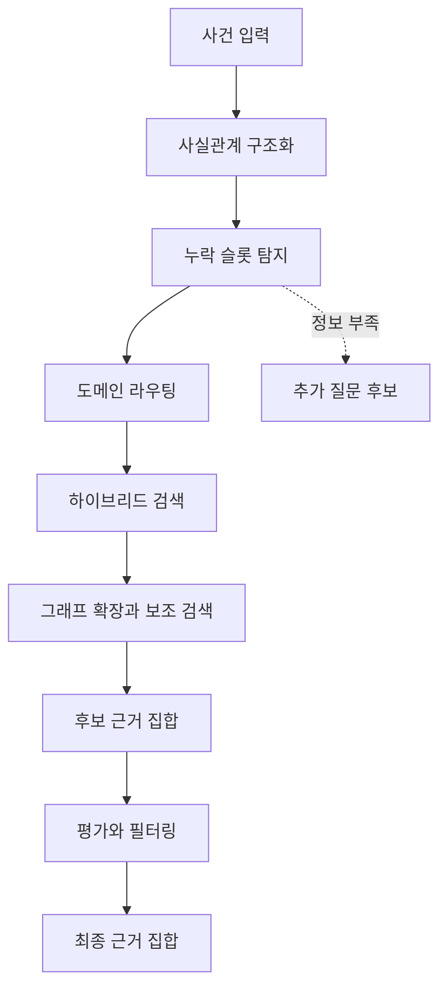
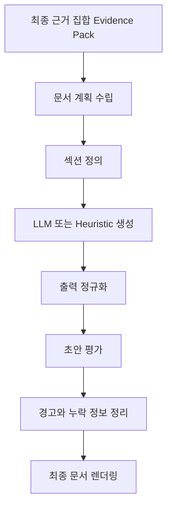

# RAG 및 LLM 문서 생성 파이프라인

이 문서는 `backend`의 문서 생성 흐름을 코드 줄 단위가 아니라 파이프라인 관점에서 설명한다. 초점은 다음 두 가지다.

- 각 단계가 왜 필요한가
- 각 단계가 최종 문서 품질과 안정성에 어떤 역할을 하는가

즉, 이 문서는 "어느 함수가 어느 함수를 부른다"보다 "왜 구조화가 retrieval보다 먼저 와야 하는가", "왜 생성 후 evaluator가 다시 붙는가", "왜 문서를 한 번에 쓰지 않고 계획과 섹션으로 나누는가"를 설명하는 문서다.

구현 파일 경로와 서비스 이름은 마지막의 `구현 매핑` 절에서만 최소한으로 정리한다.

## 1. 이 파이프라인이 풀고자 하는 문제

이 시스템은 단순한 텍스트 생성기가 아니다. 사용자가 사건 정보를 넣었을 때 다음을 동시에 만족해야 한다.

- 사건 사실관계를 일정한 구조로 해석해야 한다.
- 관련 규정, 법령, 서식 같은 근거를 먼저 찾아야 한다.
- 근거가 불충분하면 "무엇이 비어 있는지"를 알아야 한다.
- 문서는 근거를 토대로 써야 하고, 형식도 유지해야 한다.
- 생성 결과가 그럴듯해 보여도 내부 정합성과 절차적 형식이 맞는지 다시 점검해야 한다.

따라서 이 파이프라인은 "입력 -> LLM 1회 호출 -> 결과" 구조가 아니라, 다음과 같은 다단계 검증 구조를 가진다.

1. 입력을 읽기 쉬운 형태로 정리한다.
2. 어떤 근거를 찾아야 하는지 결정한다.
3. 관련 근거를 회수하고 걸러낸다.
4. 어떤 문서를 어떤 섹션으로 쓸지 계획한다.
5. 섹션별로 생성한다.
6. 생성 결과를 다시 검사하고 사용자에게 전달한다.

## 2. 한눈에 보는 추상 파이프라인

### 2-1. 전체 흐름

### 2-2. 핵심 원칙

- 구조화 없는 검색을 하지 않는다.
  - 자연어 원문만 바로 검색하면, 사건에서 중요한 역할·행위·장소·시점이 검색 질의로 충분히 반영되지 않는다.
- 근거 없는 생성을 하지 않는다.
  - 생성 단계는 retrieval 이후에만 온다.
- 문서를 한 번에 쓰지 않는다.
  - 문서 전체를 한 번에 생성하면 형식 누락, 중복, 섹션 간 논리 불일치가 늘어난다.
- 생성 결과를 그대로 신뢰하지 않는다.
  - 생성 후에도 evaluator와 정규화 계층이 다시 개입한다.
- 부족한 정보를 숨기지 않는다.
  - 필요한 정보가 없으면 "확인되지 않음", "자료상 명확하지 않음", `open_issues`, 체크리스트로 남긴다.

## 3. 단계별 설명: 왜 필요한가, 무슨 역할을 하는가

### 3-1. 입력 정규화

역할:

- 사용자의 자유 입력을 시스템이 일관되게 읽을 수 있는 형태로 바꾼다.
- 사건 제목, 발생 시점, 장소, 관련자, 요약, 상세 사실관계 같은 핵심 입력을 하나의 공통 요청 객체로 모은다.

왜 필요한가:

- 프론트에서 들어오는 입력은 화면 기준 구조이고, 내부 엔진은 검색과 생성 기준 구조를 필요로 한다.
- 이 단계가 없으면 이후 단계가 같은 의미를 서로 다른 형식으로 반복 해석해야 한다.
- 성능 관점에서도 공통 입력 표현이 있어야 이후 단계에서 재사용과 캐싱이 가능하다.

결과:

- 문서 생성 엔진이 이해하는 공통 요청
- 사건 서술형 narrative
- 초기 `StructuredCase` seed

### 3-2. 사실관계 구조화

역할:

- 사건을 "문장"이 아니라 "요소"로 바꾼다.
- 누가, 언제, 어디서, 무엇을, 어떤 맥락에서 했는지 추출한다.

왜 필요한가:

- 검색은 보통 키워드와 개체 중심으로 잘 동작한다.
- 문서 생성도 "관련자", "행위", "시점", "쟁점"이 분리되어야 더 안정적으로 쓸 수 있다.
- 같은 입력 문장이라도 구조화가 없으면 사건의 핵심 축을 놓치기 쉽다.

이 단계가 만드는 가치:

- 검색 질의 품질 향상
- 누락 정보 탐지 가능
- 문서 섹션별 초점 설정 가능

예를 들어:

- "창고 출입기록과 CCTV 확인 결과 장비 상자 2개가 정식 반출 절차 없이 이동한 정황이 포착되었다"라는 서술은
- 구조화 이후 "장소=창고", "행위=반출/이동", "대상=장비 상자", "절차 쟁점=승인 여부"처럼 다음 단계가 직접 사용할 수 있는 재료가 된다.

### 3-3. 누락 정보 점검

역할:

- 지금 가진 정보만으로 검색과 문서 생성을 진행해도 되는지 판단한다.
- 비어 있는 핵심 슬롯을 식별한다.

왜 필요한가:

- 모든 사건 입력이 완전하지 않다.
- 관련자, 행위, 대상, 시점 같은 핵심 정보가 빠진 상태에서 생성만 강행하면 문서는 그럴듯하지만 실무적으로 쓸 수 없게 된다.
- 시스템은 "모른다"를 말할 수 있어야 한다.

이 단계가 없으면 생기는 문제:

- 근거 검색이 엉뚱한 도메인으로 갈 수 있다.
- 문서가 누락 정보를 임의 추정으로 채울 가능성이 커진다.
- 이후 사용자가 무엇을 더 입력해야 하는지 알 수 없다.

출력:

- 계속 진행 가능 여부
- 추가 질문 후보
- 체크리스트 형태의 missing info

### 3-4. 도메인 라우팅

역할:

- 사건이 주로 어느 규정 체계에서 다뤄져야 하는지 우선순위를 정한다.

왜 필요한가:

- 같은 "위반"이라는 표현도 형사, 행정, 징계, 내부 복무 규정 중 어디에 가까운지에 따라 검색 대상이 크게 달라진다.
- 모든 코퍼스를 동일하게 뒤지면 검색 비용이 커지고, 노이즈도 늘어난다.

중요한 점:

- 라우팅은 최종 결론이 아니라 검색의 방향 조정이다.
- 즉, "징계 사건처럼 보인다"는 retrieval prior이지, 법적 판단 확정이 아니다.

효과:

- 검색 범위 축소
- 관련도 높은 근거 후보 우선 회수
- 성능 향상과 precision 개선

### 3-5. 근거 검색과 회수

역할:

- 사건과 관련된 법령, 규정, 판단례, 서식 같은 근거 재료를 모은다.

왜 필요한가:

- 문서 생성은 사건만 보고 쓰는 것이 아니라, 사건과 연결된 제도적 근거를 반영해야 한다.
- 징계 문서는 특히 형식과 절차 문구가 중요하므로, 근거 검색 없이 생성하면 형식 오류가 생기기 쉽다.

검색이 여러 채널을 쓰는 이유:

- 텍스트 검색은 명시적 키워드에 강하다.
- 벡터 유사도는 표현이 달라도 의미가 가까운 근거를 찾는 데 유리하다.
- 그래프 확장은 조문, 시행규칙, 관련 서식처럼 직접적으로 연결된 자료를 끌어오는 데 유리하다.

즉, 한 가지 검색 방식만으로는 놓치는 것을 보완하기 위해 hybrid retrieval을 쓴다.

### 3-6. 근거 평가와 선별

역할:

- "찾은 것"과 "실제로 써도 되는 것"을 구분한다.

왜 필요한가:

- retrieval은 후보를 넓게 모으는 단계라서 노이즈가 섞일 수밖에 없다.
- 실제 문서 생성에는 관할, 시행 시점, 폐지 여부, 문서 유형 적합성 같은 추가 검토가 필요하다.

이 단계가 하는 일:

- 후보 근거의 관련도 재평가
- 사용 가능한 근거와 제외해야 할 근거 분리
- 섹션별 어떤 근거를 붙일지 준비

핵심 의미:

- retrieval은 recall 중심
- evaluation은 precision 중심

둘을 분리해야 "많이 찾되, 아무거나 쓰지 않는" 구조가 된다.

### 3-7. Evidence Pack 조립

역할:

- 검색 결과를 문서 생성기가 바로 사용할 수 있는 작업 단위로 묶는다.

왜 필요한가:

- 생성기는 법령 목록, 판단례 목록, 서식 목록, 구조화 사건, source debug를 흩어져서 받으면 문서를 안정적으로 만들기 어렵다.
- generation 전용 입력 컨테이너가 있어야 planner, generator, evaluator가 같은 근거 집합을 공유할 수 있다.

Evidence Pack이 가지는 의미:

- "이번 문서 작성에서 공식적으로 사용하는 근거 집합"
- 이후 단계들의 공통 사실 기반

이것이 없으면:

- planner는 planner대로 다른 근거를 보고
- generator는 generator대로 다른 근거를 보고
- evaluator는 evaluator대로 다른 기준으로 검사하는 분리 현상이 생긴다.

### 3-8. 문서 계획 수립

역할:

- 어떤 문서를 어떤 섹션들로 쓸지, 각 섹션이 무엇을 담당하는지 정의한다.

왜 필요한가:

- 문서는 단순한 장문이 아니라 형식 문서다.
- 특히 조사보고, 출석통지서, 위원회 참고자료, 징계의결서는 모두 필수 구조가 있다.
- 구조 없이 한 번에 쓰면 필요한 항목이 빠지거나, 평가와 판단이 섞이거나, 결론이 앞서 나가기 쉽다.

planner가 하는 일:

- 문서 타입별 섹션 정의
- 각 섹션의 목적 정의
- 필요한 근거 유형 지정
- 추가 검색 키워드 제안

효과:

- 생성 단계의 자유도를 적절히 제한
- 형식 보장
- evaluator가 검사할 기준점 제공

### 3-9. 계획 기반 추가 retrieval

역할:

- 초기에 모은 근거만으로 부족할 때, 계획된 섹션을 기준으로 추가 자료를 더 회수한다.

왜 필요한가:

- 처음 검색은 사건 전체 중심이다.
- 하지만 문서를 실제로 쓰기 시작하면 "이유 섹션", "적용 규정", "첨부자료 목록"처럼 더 구체적인 근거가 필요할 수 있다.

즉:

- 1차 retrieval은 사건 중심 수집
- 추가 retrieval은 문서 중심 보강

이 단계는 성능 비용이 있지만, 문서 완성도와 grounding 품질을 높인다.

### 3-10. 섹션별 생성

역할:

- planner가 정의한 섹션 단위로 실제 문안을 만든다.

왜 필요한가:

- 긴 문서를 한 번에 생성하면 섹션 간 품질 편차가 커지고, 특정 섹션 형식을 강제하기 어렵다.
- 섹션 단위로 나누면 "이 섹션은 사실만", "이 섹션은 규정만", "이 섹션은 판단 포인트만"처럼 제약을 명확히 줄 수 있다.

이 단계의 두 가지 경로:

- LLM 생성
  - 더 자연스럽고 풍부한 문안을 만들기 좋다.
- heuristic 생성
  - 형식 안정성과 fallback 용도로 유리하다.

시스템이 둘 다 쓰는 이유:

- LLM은 품질 상한이 높다.
- heuristic은 실패 시 안전망이 된다.
- 둘을 병합하면 "표현력"과 "형식 안정성"을 동시에 확보할 수 있다.

### 3-11. 생성 결과 정규화와 누출 제거

역할:

- LLM이 프롬프트 문구, 제목, JSON 잔재, 내부 지시문을 에코했을 때 이를 잘라낸다.

왜 필요한가:

- 생성 모델은 가끔 본문 대신 프롬프트 일부, 제목, 출력 형식 안내를 그대로 내보낸다.
- 이런 텍스트가 최종 문서에 섞이면 문서 신뢰도가 크게 떨어진다.

이 단계의 의미:

- 생성 결과를 "문서 본문"으로 정제하는 마지막 방어선
- 형식은 맞지만 실무 문서가 아닌 응답을 실제 문서로 오인하지 않게 막는 단계

### 3-12. 초안 평가와 안전장치

역할:

- 생성이 끝난 뒤 문서가 실무적으로 최소 기준을 만족하는지 점검한다.

왜 필요한가:

- retrieval이 있었다고 해서 문서가 자동으로 안전한 것은 아니다.
- 섹션 누락, 근거 연결 부족, 금지 표현, 날짜/형식 불일치는 generation 이후에도 발생한다.

evaluator가 보는 것:

- 필요한 섹션이 있는가
- 섹션과 근거의 연결이 충분한가
- 문체 제약을 어겼는가
- 경고를 남겨야 하는가

이 단계는 문장을 "더 아름답게" 만드는 것이 아니라, 문서를 "더 신뢰 가능하게" 만드는 단계다.

### 3-13. 문서 렌더링과 응답 조립

역할:

- 섹션 기반 초안을 사람이 읽는 최종 문서 형태로 조립한다.
- 프론트가 필요로 하는 사건/문서/버전 이력/리뷰 이력 구조로 감싼다.

왜 필요한가:

- 엔진 내부 표현과 프론트가 보여줄 표현은 다르다.
- 내부에서는 `sections`, `citations`, `open_issues`, `warnings`가 필요하지만, 사용자 화면에서는 "문서 본문", "버전 노트", "검토 요약"이 필요하다.

중요한 원칙:

- 문서 본문과 내부 진단 정보는 분리해야 한다.
- 본문은 문서 자체만 포함하고
- 누락 정보, 경고, 보완 포인트는 버전 노트나 별도 메타데이터로 보내는 것이 맞다.

## 4. 추상 그래프: RAG 단계만 따로 보기

이 그래프에서 중요한 점은, RAG의 목적이 "많이 찾는 것"이 아니라 "문서 생성에 써도 되는 근거 집합을 만드는 것"이라는 점이다.

## 5. 추상 그래프: 문서 생성 단계만 따로 보기

이 그래프는 "생성"이 실제로는 단일 단계가 아니라는 것을 보여준다. 실무적으로 중요한 것은 생성 이전의 계획과 생성 이후의 점검이다.

## 6. 왜 이 구조가 필요한가

### 6-1. one-shot generation의 한계

한 번의 LLM 호출로 바로 최종 문서를 만들면 다음 문제가 발생한다.

- 사건 구조를 잘못 이해한 채 자신감 있게 문서를 쓸 수 있다.
- 관련 규정 없이 그럴듯한 문장을 만들 수 있다.
- 형식상 꼭 있어야 할 항목을 빠뜨릴 수 있다.
- 부족한 정보를 추정으로 메울 수 있다.
- 문서와 무관한 프롬프트 잔재가 들어갈 수 있다.

현재 구조는 이런 문제를 줄이기 위해 다음 방식을 쓴다.

- 구조화로 입력을 먼저 분해한다.
- retrieval로 근거를 먼저 확보한다.
- planner로 문서 형식을 먼저 고정한다.
- section generation으로 범위를 좁혀 쓴다.
- evaluator로 마지막 검사를 한다.

### 6-2. grounded generation이 필요한 이유

징계 문서는 단순 요약문이 아니다. 다음이 중요하다.

- 절차적 표현
- 규정과 사실의 대응
- 판단이 아니라 참고 또는 보고의 문체 유지
- 누락 정보의 명시

따라서 문장 유창성보다 먼저 필요한 것은 grounding이다. 이 시스템에서 retrieval이 generation보다 먼저 오는 이유가 여기에 있다.

### 6-3. 질문 생성이 파이프라인 안에 있어야 하는 이유

질문 생성은 부가 기능이 아니라 문서 품질 관리 장치다.

- 입력이 부족하면 바로 질문으로 되돌려야 한다.
- evaluator가 문제가 있다고 보면 다시 사용자 보완으로 연결해야 한다.
- 즉, 질문은 문서 생성 실패의 예외 처리가 아니라 정상적인 품질 관리 루프다.

## 7. 두 개의 진입 경로를 어떻게 이해하면 되는가

### 7-1. 엔진 직접 호출 경로

`/services/documents/generate`

의미:

- 문서 생성 엔진만 독립적으로 검증하는 경로
- retrieval, planning, generation, evaluation을 직접 확인할 때 사용

적합한 상황:

- prompt 실험
- RAG 품질 점검
- LLM fallback 검증

### 7-2. 사건 오케스트레이션 경로

`/api/cases`

의미:

- 사건을 생성하면서 여러 문서를 한 번에 준비하는 경로
- 프론트가 바로 사용할 사건 상세, 문서 목록, 워크플로우 상태까지 조립한다

적합한 상황:

- 실제 제품 동작
- 화면 연동
- 문서 패키지 초기화

핵심 차이:

- 직접 호출은 "엔진 중심"
- 사건 생성은 "사용자 경험 중심"

하지만 두 경로 모두 내부적으로는 같은 retrieval/generation 엔진을 공유한다.

## 8. 운영과 품질 관점에서 봐야 할 포인트

### 8-1. 좋은 파이프라인의 기준

- 입력이 부족할 때 이를 숨기지 않는다.
- 근거 없는 결론을 과장하지 않는다.
- 문서 형식이 문서 종류에 맞게 안정적으로 유지된다.
- LLM 실패 시에도 최소한의 구조화 문서는 남는다.
- 사용자에게 보여주는 본문과 내부 진단 정보가 섞이지 않는다.

### 8-2. 장애가 나도 시스템이 무너지지 않아야 한다

그래서 현재 파이프라인은 다음의 복원성을 가진다.

- retrieval이 일부 부족해도 초안은 생성 가능
- LLM이 실패해도 heuristic fallback 가능
- 문서가 불완전해도 missing info와 warning을 함께 반환 가능
- 프론트는 문서 상태와 보완 포인트를 계속 표시 가능

### 8-3. 성능 최적화 포인트를 어디서 봐야 하는가

추상적으로 보면 성능 비용은 주로 세 군데에서 발생한다.

- 구조화와 retrieval
- 추가 retrieval loop
- 섹션별 생성

따라서 성능을 올릴 때는 보통 다음을 본다.

- 입력 정규화 결과 재사용
- 섹션 간 반복 파싱 제거
- retrieval 범위 축소와 라우팅 정확도 개선
- plan retrieval loop를 필요한 경우에만 실행
- 문서별 병렬 생성

## 9. 구현 매핑

아래는 개념 단계를 현재 코드 구조와 연결하기 위한 최소 매핑이다.

| 개념 단계 | 현재 모듈 |
| --- | --- |
| 입력 정규화 | `schemas/documents.py` |
| 사실관계 구조화 | `search/structuring.py` |
| 누락 정보 점검 | `search/structuring.py`, `search/pipeline.py` |
| 도메인 라우팅 | `search/routing.py` |
| 근거 검색과 회수 | `search/retrieval.py`, `documents/evidence.py` |
| 근거 평가와 선별 | `search/evaluation.py` |
| Evidence Pack 조립 | `documents/evidence.py` |
| 문서 계획 수립 | `documents/planning.py` |
| 섹션별 생성 | `documents/generator.py`, `documents/gemini.py` |
| 출력 정규화와 병합 | `documents/service.py` |
| 초안 평가 | `documents/evaluation.py` |
| 사건 오케스트레이션 | `case_management/service.py` |
| API 진입점 | `main.py` |

## 10. 이 문서를 읽는 방법

질문이 이런 종류라면 이 문서의 해당 절을 먼저 보면 된다.

- "왜 retrieval이 generation보다 먼저 오나?"
  - `3-5`, `6-2`
- "왜 문서를 한 번에 안 쓰고 섹션으로 나누나?"
  - `3-8`, `3-10`
- "왜 추가 질문이 문서 생성 안에 포함되나?"
  - `3-3`, `6-3`
- "왜 LLM 응답을 그대로 쓰면 안 되나?"
  - `3-11`
- "왜 본문과 경고를 분리해야 하나?"
  - `3-13`
- "성능을 어디서 개선해야 하나?"
  - `8-3`

이 문서는 구현을 숨기기 위한 문서가 아니다. 구현을 이해하기 전에, 현재 구조가 어떤 품질 문제를 해결하기 위해 존재하는지 먼저 이해하기 위한 문서다.
